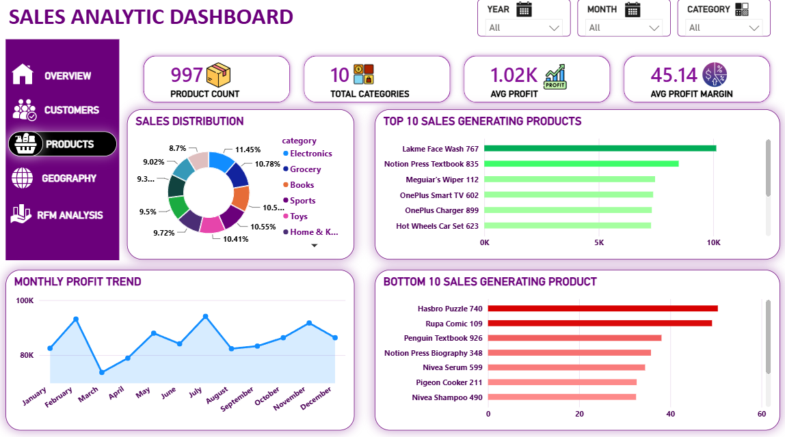
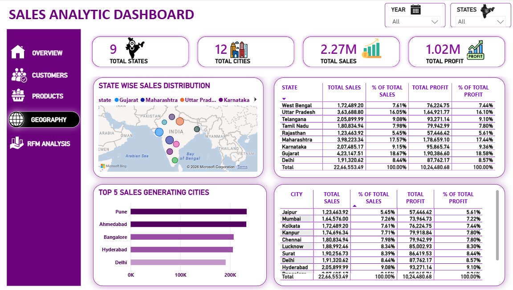
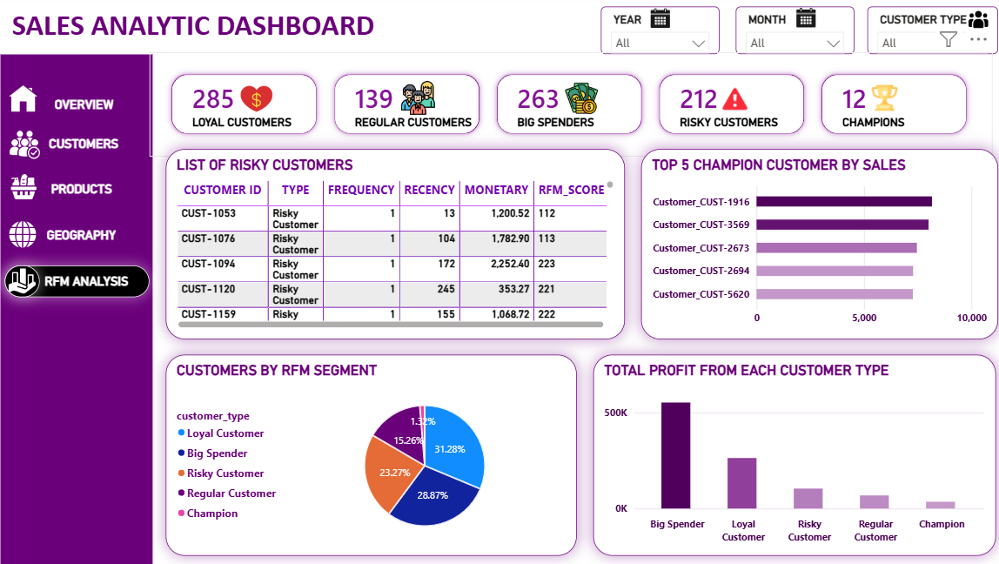

# Sales Analytics - End to End Project

---

## About This Project

I am Yash Shukla, an aspiring data analyst from India. This is my first end to end data analytics project where I worked on everything myself - from creating the dataset to building the final dashboard. I built this project to learn how real world data analysis works and to grow my skills in SQL, Python and Power BI.

The dataset I used is a custom dataset I created myself based on Amazon India sales data. It covers 911 customers, 997 products and sales across 9 Indian states.

---

## Dashboard Preview

---

## Key Business Insights

- Gujarat is the top performing state contributing 18.6% of total revenue across all 9 states
- Big Spenders are only 29% of customers but drive more than 54% of total profit
- Electronics is the highest selling category generating around 2.98 lakh in revenue
- 212 risky customers were identified using RFM analysis who need immediate retention action
- Monthly sales were consistent throughout the year with the highest peak coming in July

---

## Tools Used

| Tool | Usage |
|------|-------|
| MySQL 8.0 | Data modelling, joins, window functions, RFM scoring |
| Python | Data cleaning and preprocessing |
| Power BI | 5 page interactive dashboard |

---

## Project Structure
sales-analytics/

├── 01_dataset/     → Data dictionary

├── 02_sql/         → 7 SQL analysis scripts

├── 03_python/      → Data cleaning script

├── 04_dashboard/   → Power BI .pbix file

└── 05_screenshots/ → Dashboard page images

---

## SQL Files Breakdown

| File | What It Does |
|------|-------------|
| 01_table_setup.sql | Database setup and merged table creation |
| 02_kpi_analysis.sql | Total sales, profit, orders and cost KPIs |
| 03_customer_analysis.sql | Customer segments and top customers by state |
| 04_product_analysis.sql | Top and bottom products and category wise profit |
| 05_time_analysis.sql | Monthly trends and MoM growth using LAG function |
| 06_geographic_analysis.sql | State and city wise sales and discount analysis |
| 07_rfm_analysis.sql | RFM scoring using NTILE and CASE WHEN logic |

---

## Dashboard Pages

- **Overview** - Total sales, profit, category performance and payment mode breakdown
- **Customers** - Gender split, top customers by sales and profit and India map
- **Products** - Top and bottom performing products and profit margins
- **Geography** - State and city wise sales and profit with percentage breakdown
- **RFM Analysis** - Customer segmentation into Champions, Loyal, Big Spenders, Regular and Risky

---

## What I Learned

- Writing complex SQL queries using window functions, CTEs and RFM scoring logic
- How to clean and preprocess raw data using Python before analysis
- Building multi page interactive dashboards in Power BI with slicers and maps
- How to think like an analyst by asking the right business questions
- Understanding customer behaviour through RFM segmentation

---

## Connect With Me

**GitHub** - github.com/Yashshukla11111

**LinkedIn** - add your linkedin link here
